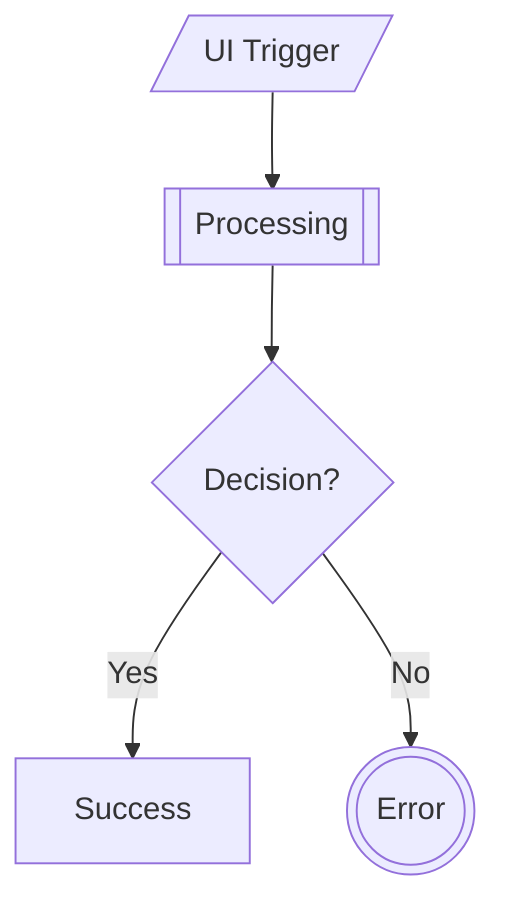

# Fastlane UX Slides

A presentation about **Fastlane UX** - a bridge between code and design, built with [Marp](https://marp.app/) for creating beautiful slides from Markdown.

## 🎯 About Fastlane UX

Fastlane UX is a proposal to strengthen development workflows by introducing a simple clarity step that:
- 🚫 Reduces rework by catching UX issues early
- ⚠️ Ensures product quality through better alignment
- 🧩 Creates predictable flow for development teams

## 🚀 Features

- **Markdown-based slides** - Write presentations in simple Markdown
- **Multiple Rose Pine themes** - Dawn, Moon, and default variants
- **Mermaid diagrams** - Support for creating user flow diagrams
- **Local file support** - Include local images and assets
- **Multiple output formats** - Generate HTML, PDF, and PowerPoint presentations
- **Live preview** - Real-time development with auto-reload

## 📁 Project Structure

```
slides/
├── slides/           # Source Markdown files
│   ├── slide.md     # Main Fastlane UX presentation
│   ├── slide.html   # Generated HTML output
│   └── img/         # Presentation images
├── themes/          # Custom CSS themes
│   ├── rose-pine.css
│   ├── rose-pine-dawn.css
│   └── rose-pine-moon.css
├── docs/            # Documentation and resources
├── marp.config.js   # Marp configuration
└── package.json     # Project dependencies
```

## 🛠️ Setup

**Install dependencies:**
```bash
pnpm install
```

## 📖 Usage

### Live presentation server (recommended)
```bash
marp -s -c marp.config.js
```
This starts a local server with your custom configuration for live presentations.

### Generate HTML presentation
```bash
marp slides/slide.md --output slides/slide.html
```

### Generate PDF presentation
```bash
marp slides/slide.md --pdf --output slides/presentation.pdf
```

### Generate PowerPoint presentation
```bash
marp slides/slide.md --pptx --output slides/presentation.pptx
```

### Live preview with auto-reload
```bash
marp slides/slide.md --server --watch
```

## 🎨 Themes

This project includes three Rose Pine themes:
- **rose-pine.css** - Default Rose Pine theme
- **rose-pine-dawn.css** - Light variant (currently used)
- **rose-pine-moon.css** - Dark variant

To use a specific theme in your slides, add this to your Markdown:
```markdown
---
marp: true
theme: rose-pine-dawn
---
```

## 📊 Diagrams

This project supports [Mermaid](https://mermaid.js.org/) diagrams for creating user flow diagrams. You can create various types of diagrams using Mermaid syntax in your Markdown:

```markdown

```

### User Flow Standard

The presentation includes a standardized approach to user flow diagrams:
- `[/…/]` - UI Trigger (user actions)
- `[\…\]` - UI Prompt (user input requests)
- `[…]` - System Output (UI feedback)
- `[[…]]` - Processing (system logic)
- `{…}` - Decision (branching logic)
- `(((…)))` - Error (error states)

## 🔧 Configuration

The project is configured via `marp.config.js`:
- Input directory: `./slides`
- Local files allowed: `true`
- Kroki integration enabled for Mermaid diagrams
- Custom Rose Pine theme set included

## 📝 Writing Slides

Write your slides in Markdown format. Each slide is separated by `---`:

```markdown
---
marp: true
theme: rose-pine-dawn
paginate: true
---

# Slide 1
Content goes here

---

# Slide 2
More content here
```

## 🎨 Wireframing Tools

The presentation covers wireframing tools for non-designers:
- **Excalidraw** - Sketch-like wireframing tool
- **FigJam** - Collaborative whiteboard
- **Mermaid** - Text-based diagramming

## 🚀 Development

- Edit `slides/slide.md` to modify your presentation
- Use `marp --server --watch` for live preview during development
- Generated files are automatically ignored by git (see `.gitignore`)

## 📚 Additional Resources

The presentation references several resources:
- [Fastlane UX Proposal](https://www.notion.so/defi-wonderland/Fastlane-UX-A-bridge-between-code-and-design-2169a4c092c7803da0d5e258ba13efef)
- [User Flow Standard](https://www.notion.so/defi-wonderland/User-flow-standard-2339a4c092c780d785a4cae477aab8d5)
- [Wireframing for Non-designers](https://www.notion.so/defi-wonderland/Wireframing-for-Non-designers-2339a4c092c78029a83cd072ac73d413)
- [Excalidraw Cheatsheet](https://www.notion.so/defi-wonderland/Excalidraw-Cheatsheet-for-Wireframing-2339a4c092c7800294e9edbd0914188d)

## 📄 License

ISC License 