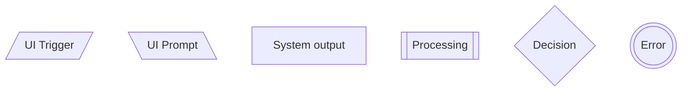

# User flow standard

This document establishes a company-wide standard for creating user flow diagrams. User flows are essential artifacts that help us visualize the complete path a user takes to accomplish a task.

# ❓ Why do we need a standard?

- **Clarity & Consistency:** A single, shared language for diagrams eliminates ambiguity and ensures everyone—from designers to engineers to product managers—can understand the user's journey at a glance.
- **Efficiency:** Standardized tools and templates accelerate the creation process and make collaboration seamless.
- **Quality:** By focusing on user-centric actions and feedback, we ensure our diagrams accurately reflect the user experience, leading to better product decisions.

# 🧑‍💻 Mermaid

Mermaid is a text-based tool for generating diagrams and charts. We use it as the "source of truth" for our user flows because it is:

- **Easy to Edit:** You can quickly modify a flow by changing a few lines of text, without needing to manually realign shapes.
- **Integration-Friendly:** It can be embedded directly into documentation platforms like Confluence, Notion, or internal wikis.

## Standard Shapes and Meanings

The following table defines the official shapes and their corresponding intents for all user flow diagrams. Sticking to these conventions is cru*cial for maintaining clarity and consistency.*

| **Mermaid** | **Intent Type** | Description | Shape |
| --- | --- | --- | --- |
| [/…/] | UI Trigger | UI action initiated by user (click, submit, etc.) | Parallelogram |
| [\…\] | UI Prompt | Request for user input or confirmation | Parallelogram alt |
| […] | System Output | UI feedback shown to user | Rectangle |
| [[…]] | Processing | System logic or computational task | Double rectangle |
| {…} | Decision | Condition or branching logic (yes/no or success/fail) | Diamond |
| (((…))) | Error | Error state or user-facing error message | Double circle (octagon in Figma) |



# 👨‍🎨 FigJam

FigJam is our collaborative whiteboarding tool. While Mermaid is our source of truth, FigJam is our space for ideation, collaboration, and presentation.

The official FigJam template contains pre-built components for all our standard shapes, making it easy to build and discuss flows visually with the team. Use FigJam when:

- Brainstorming initial flow ideas.
- Collaborating in real-time with PMs, engineers, and other stakeholders.
- Presenting a flow during design reviews.

[https://www.figma.com/board/ZOdKsuqIg9Oo4ISCFtTpSG/User-flow-standard?node-id=0-1&t=ADjb9pLhMhNKEVKE-1](https://www.figma.com/board/ZOdKsuqIg9Oo4ISCFtTpSG/User-flow-standard?node-id=0-1&t=ADjb9pLhMhNKEVKE-1)

# 🤖 Sequence diagram to flowchart using AI

## AI-Assisted Workflow

To accelerate our workflow, we use an AI prompt to translate a technical `sequenceDiagram` into user-centric `flowchart`. This is especially useful when working from engineering specs or technical documentation.

A **sequence diagram** shows how different system components interact over time. Our goal is to convert that technical view into a **user flow** that shows the journey from the user's perspective.

## The Prompt

The following prompt is designed to instruct an LLM (like ChatGPT) to perform this translation while adhering to our standards. It ensures the output is human-centered and uses our defined Mermaid syntax.

- Prompt
    
    ```
    You are a UX designer and expert in human-centered flowchart creation.
    
    Please translate the following Mermaid `sequenceDiagram` into a user-centered Mermaid `flowchart TD`, using this visual intent standard:
    
    | Intent Type | Description | Shape | Mermaid Syntax |
    | :--- | :--- | :--- | :--- |
    | UI Trigger | UI action initiated by the user | Parallelogram | `[/.../]` |
    | UI Prompt | Request for user input or confirmation | Parallelogram (alt) | `[\...]` |
    | System Output | UI feedback shown to the user | Rectangle | `[...]` |
    | Processing | System logic or computation | Double rectangle | `[[...]]` |
    | Decision | Branching logic or conditions | Diamond | `{...}` |
    | Error | Error or user-facing error message | Double Circle | `(((...)))` |
    
    Please follow these requirements:
    
    1.  **Interpret from the user’s perspective** — this is about designing the user experience, not modeling backend APIs.
    2.  Focus only on **actions, decisions, inputs, and visible feedback** that a user would encounter.
    3.  The text labels inside the Mermaid node shapes must **not contain double quotes (`"`) or parentheses (`()`)**. Rephrase content as needed to adhere to this rule.
    4.  Use reference markers (e.g., `*1`, `*2`) within the flowchart nodes to link specific steps to their corresponding details in the supplementary sections.
    5.  Do not include passive or informational statements (e.g., “This cannot be linked to X”) as steps in the flow. These should not appear inside the diagram.
    6.  If the original diagram includes supplementary details, context, or non-actionable notes, extract them. Use the reference markers from the flowchart to link this information back to the relevant steps in a separate supplementary section (e.g., *1: This note refers to the 'Fund Account' step.).
    7.  If the sequence diagram lacks sufficient detail to create a complete user-centered flow, **identify these ambiguities**. Formulate them as questions in a separate section labeled 'Open Questions', referencing specific steps using their markers where applicable.
    8.  Do not output anything except:
        *   One clean Mermaid flowchart code block, showing only the actionable flow with reference markers.
        *   If needed, a clearly separated supplementary markdown block underneath, labeled with a descriptive title that reflects its content (e.g., "Supplementary Notes," "Informational Details," "Security Considerations"), for any extracted non-flow information.
        *   If applicable, a final section labeled "Open Questions" containing your clarifying questions about the user experience.
    
    [mermaid code here]
    ```
    

# ⚙️ Mermaid to Figma Plugins [EXPERIMENTAL]

To bridge the gap between our text-based Mermaid code and our visual FigJam boards, we use plugins. These tools allow you to instantly generate an editable or static diagram in Figma/FigJam from your Mermaid code.

## Recommended Plugins:

### 1. Mermaid-in-Figma (for static images)

Use this to quickly generate a non-editable image of your chart. Ideal for presentations or documentation where you just need to display the final flow.

[](https://www.figma.com/community/plugin/1326922376721037678/mermaid-in-figma)

### 2. Mermaid-to-FigJam / Mermaid-to-Flow (for editable diagrams)

Use these plugins to convert your Mermaid code into native, editable FigJam shapes. This is the preferred method for bringing a "source of truth" flow into FigJam for further discussion or visual refinement.

<aside>
⚠️

It's far from perfect. It could speed up the process a bit.

</aside>

[](https://www.figma.com/community/plugin/1515624006157749329/mermaid-to-figjam)

[](https://www.figma.com/community/plugin/1515823722187210177/mermaid-to-flow)

# 📦 Example

[User flow example](User%20flow%20standard%202339a4c092c780d785a4cae477aab8d5/User%20flow%20example%202339a4c092c780f195e4cb248f465a7b.md)

# Next step: Wireframes