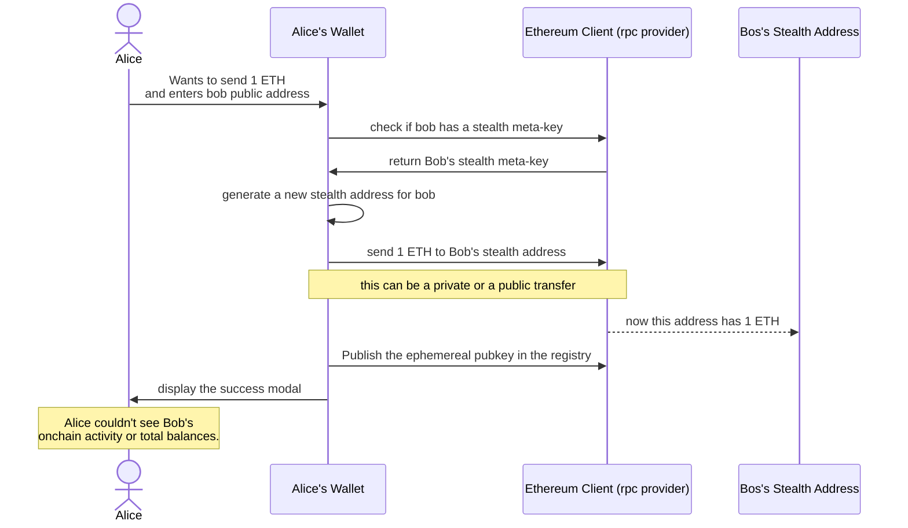

# User flow example

## Input



## Generate user flow

- Prompt
    
    ```
    You are a UX designer and expert in human-centered flowchart creation.
    
    Please translate the following Mermaid `sequenceDiagram` into a user-centered Mermaid `flowchart TD`, using this visual intent standard:
    
    | Intent Type | Description | Shape | Mermaid Syntax |
    | :--- | :--- | :--- | :--- |
    | UI Trigger | UI action initiated by the user | Parallelogram | `[/.../]` |
    | UI Prompt | Request for user input or confirmation | Parallelogram (alt) | `[\...]` |
    | System Output | UI feedback shown to the user | Rectangle | `[...]` |
    | Processing | System logic or computation | Double rectangle | `[[...]]` |
    | Decision | Branching logic or conditions | Diamond | `{...}` |
    | Error | Error or user-facing error message | Double Circle | `(((...)))` |
    
    Please follow these requirements:
    
    1.  **Interpret from the user’s perspective** — this is about designing the user experience, not modeling backend APIs.
    2.  Focus only on **actions, decisions, inputs, and visible feedback** that a user would encounter.
    3.  The text labels inside the Mermaid node shapes must **not contain double quotes (`"`) or parentheses (`()`)**. Rephrase content as needed to adhere to this rule.
    4.  Use reference markers (e.g., `*1`, `*2`) within the flowchart nodes to link specific steps to their corresponding details in the supplementary sections.
    5.  Do not include passive or informational statements (e.g., “This cannot be linked to X”) as steps in the flow. These should not appear inside the diagram.
    6.  If the original diagram includes supplementary details, context, or non-actionable notes, extract them. Use the reference markers from the flowchart to link this information back to the relevant steps in a separate supplementary section (e.g., *1: This note refers to the 'Fund Account' step.).
    7.  If the sequence diagram lacks sufficient detail to create a complete user-centered flow, **identify these ambiguities**. Formulate them as questions in a separate section labeled 'Open Questions', referencing specific steps using their markers where applicable.
    8.  Do not output anything except:
        *   One clean Mermaid flowchart code block, showing only the actionable flow with reference markers.
        *   If needed, a clearly separated supplementary markdown block underneath, labeled with a descriptive title that reflects its content (e.g., "Supplementary Notes," "Informational Details," "Security Considerations"), for any extracted non-flow information.
        *   If applicable, a final section labeled "Open Questions" containing your clarifying questions about the user experience.
    
    sequenceDiagram
    actor a as Alice
    participant aw as Alice's Wallet
    participant rpc as Ethereum Client (rpc provider)
    participant acc2 as Bos's Stealth Address
    
    a->>aw: Wants to send 1 ETH<br/>and enters bob public address
    aw->>rpc: check if bob has a stealth meta-key
    rpc->>aw: return Bob's stealth meta-key
    aw->>aw: generate a new stealth address for bob
    aw->>rpc: send 1 ETH to Bob's stealth address
    note over aw,rpc: this can be a private or a public transfer
    rpc-->>acc2: now this address has 1 ETH
    aw->>rpc: Publish the ephemereal pubkey in the registry
    aw->>a: display the success modal
    
    note over a: Alice couldn't see Bob's<br/>onchain activity or total balances.
    ```
    
- Output (Gemini 2.5 Pro)
    
    ```mermaid
    flowchart TD
        A[/Enters recipient address and send amount *1/] --> B
        B[[Processing transaction *2]] --> C{Transaction Successful?}
        C -->|Yes| D[Displays transaction success message *3]
        C -->|No| E(((Transaction Failed)))
    
    ```
    
    ### Supplementary Notes
    
    - **1. Send Details*: The user initiates a transfer by providing the recipient's public address and the amount of ETH to send.
    - **2. Stealth Transaction Processing*: In the background, the wallet performs several steps:
        - Checks if the recipient has a stealth meta-key.
        - Generates a unique, one-time stealth address for the recipient.
        - Sends the ETH to this new stealth address.
        - Publishes an ephemeral public key to a registry, allowing the recipient to discover and access the funds.
    - **3. Privacy Benefit*: A key outcome of this flow is that an observer of the blockchain cannot link this transaction to the recipient's main address, nor can they see the recipient's total balance or on-chain activity.
    
    ### Open Questions
    
    - **2. Recipient Lacks Stealth Key*: What is the user experience if the recipient's address does not have a registered stealth meta-key? Is an error displayed, or does the wallet fall back to a standard, non-stealth transaction?
    - **2. Transfer Type*: The original diagram notes a transfer can be "private or public." Is the user prompted to choose the transfer type, or does the system decide this automatically?
    - **3. Success Modal Content*: What specific information is shown in the success modal? Does it include a confirmation, transaction hash, or a link to a block explorer?
    - **E. Failure State**: What specific error information is provided to the user if the transaction fails? Does it explain the reason (e.g., insufficient funds, network error)?

## Figma

[https://www.figma.com/board/qYn6A3Tv0bEbOaLMMNLhzf/User-flow-example?node-id=0-1&t=q4BvZG0DYosRPbx1-1](https://www.figma.com/board/qYn6A3Tv0bEbOaLMMNLhzf/User-flow-example?node-id=0-1&t=q4BvZG0DYosRPbx1-1)