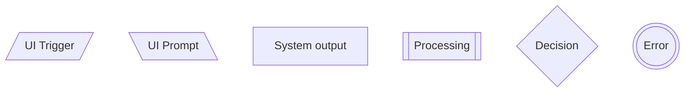
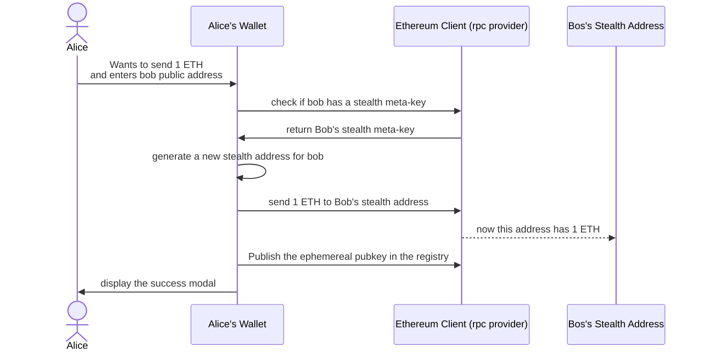
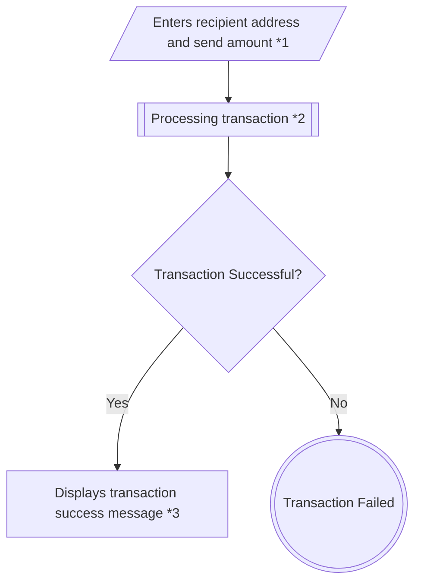

# Fastlane UX
## A Proposal to Strengthen Our Development Process

**Objective:** To propose a lightweight process designed to increase development velocity, reduce rework, and enhance the quality of our products.

<!-- An example note -->

---

# The Challenge

Our team consistently ships excellent work, but as we've scaled, we've encountered natural growing pains common in fast-moving companies.

## Key Areas for Improvement

- **🚫 Reducing Rework:** Catching misalignments *before* code is written
- **⚠️ Ensuring Product Quality:** Preventing critical usability issues from reaching late stages  
- **🧩 Creating Predictable Flow:** Giving the development team the clarity they need to build with fewer blockers

---

# Recent Case Studies

## Case Study 1: Privacy Pools
**The Problem:** Development started without a clear interface to build, leading to partner-requested redesigns *after* code implementation.

**Impact:** Significant rework and delays that could be avoided with a clearer starting point.

## Case Study 2: EF Wallet  
**The Problem:** Late UX review identified critical issues:
- Users' private funds were obscured behind a switch
- "Send" flow truncated wallet addresses, creating risk of irreversible fund loss

**Impact:** Last-minute fixes required. A proactive check could have prevented these issues.

---

# Introducing Fastlane UX

A proposal to **build right, faster, and eliminate rework** by introducing a simple clarity step.

## What It Is
- A short, async, pre-development step to ensure everyone is aligned
- Focuses on creating a single "source of truth" for user flows

## What It Is NOT
- A new layer of bureaucracy
- More meetings
- A design-heavy process

---

# How Fastlane UX Works

| Step | What Happens | Owned By |
|------|-------------|----------|
| **1. User Flow Sketch** | Quick flow diagram with edge cases is drafted. UI Wireframes can also be helpful. | Product Engineer |
| **2. Async Review** | Devs & stakeholders iterate the flow / UI. | Project Team |
| **3. Document the Product** | Include the revised flow and UI to the Tech Design. | Team Leader |
| **4. Greenlight to Code** | Dev scope is clear, with no blockers. | Team Leader |

---

# The Product Engineer Role

A facilitation role designed to support our engineers. It's a hybrid function that drives product clarity and UX quality **before** engineering begins.

## Core Responsibilities

- Facilitate the **Fastlane UX** process
- Translate ideas into clear **user flows and edge cases**
- Create the **"source of truth"** that aligns design, dev, and partners
- Serve as a resource for developers, providing instant clarity on user flows

---

# Why This Matters

This small change has a big impact on the things our business cares about most.

| Concern | How Fastlane UX Helps |
|---------|----------------------|
| **🚫 Rework Costs** | Catches all UX/flow issues before development starts |
| **⚠️ Product Risk** | Prevents critical bugs |
| **🧩 Coordination Overhead** | Creates one clear "source of truth" to eliminate confusion |
| **🚀 Shipping Velocity** | Reduces dev questions, blockers, and back-and-forth |
| **🤝 Partner Trust** | Improves the polish and consistency of everything we ship |

---

# User Flow Standards

## Why We Need Standards

- **Clarity & Consistency:** Single, shared language for diagrams eliminates ambiguity
- **Efficiency:** Standardized tools and templates accelerate creation process
- **Quality:** User-centric focus ensures accurate reflection of user experience

---

# Mermaid: Our Source of Truth

Mermaid is a text-based tool for generating diagrams and charts. We use it because it is:

- **Easy to Edit:** Quickly modify flows by changing text, not manually realigning shapes
- **Integration-Friendly:** Can be embedded directly into documentation platforms

---

# Standard Shapes and Meanings

| Mermaid | Intent Type | Description | Shape |
|-------------|----------------|-------------|-------|
| `[/…/]` | UI Trigger | UI action initiated by user (click, submit, etc.) | Parallelogram |
| `[\…\]` | UI Prompt | Request for user input or confirmation | Parallelogram alt |
| `[…]` | System Output | UI feedback shown to user | Rectangle |
| `[[…]]` | Processing | System logic or computational task | Double rectangle |
| `{…}` | Decision | Condition or branching logic | Diamond |
| `(((…)))` | Error | Error state or user-facing error message | Double circle |

---

# Mermaid Flowchart Example
```
flowchart TD
    A[/UI Trigger/]
    B[\UI Prompt\]
    C[System output]
    D[[Processing]]
    E{Decision}
    F(((Error)))
```
<style scoped>
  .kroki-image-container {
    background: transparent;
  }
</style>


---

# FigJam: Our Collaboration Space

While Mermaid is our source of truth, FigJam is our space for ideation, collaboration, and presentation.

## When to Use FigJam

- Brainstorming initial flow ideas
- Collaborating in real-time with PMs, engineers, and stakeholders
- Presenting a flow during design reviews

**Template:** [User Flow Standard FigJam Board](https://www.figma.com/board/ZOdKsuqIg9Oo4ISCFtTpSG/User-flow-standard?node-id=0-1&t=ADjb9pLhMhNKEVKE-1)

---

# AI-Assisted Workflow

## Sequence Diagram to Flowchart Conversion

We use AI to translate technical `sequenceDiagram` into user-centric `flowchart`, especially useful when working from engineering specs.

### The Process
1. Start with technical sequence diagram
2. Use AI prompt to convert to user-centered flowchart
3. Follow our visual intent standards
4. Focus on user perspective, not backend APIs

---

# User Flow Example: Stealth Transaction
<style scoped>
.kroki-image-container {
    transform: scale(0.75);
  }
</style>


---

# User Flow Example: Output (Flowchart)
<style scoped>
.kroki-image-container {
    transform: scale(0.7) translateY(-15%);
  }
</style>


## Supplementary Notes
- **1. Send Details:** User provides recipient's public address and ETH amount
- **2. Stealth Processing:** Wallet checks stealth meta-key, generates stealth address, sends ETH, publishes ephemeral key
- **3. Privacy Benefit:** Observer cannot link transaction to recipient's main address

---

# Wireframing for Non-designers

## The Three Core Ideas

1. **It's a Rough, Functional Sketch** - Not polished design, but functional outline
2. **Use the Simplest Shapes Possible** - Keeps process fast and focused on structure
3. **Give Each Screen One Core Goal** - Each screen has one primary purpose

---

# How to Sketch Wireframes

## Step 1: Define the Screen's Purpose
Ask: What is the main goal? What inputs does it need? What information will it display?

## Step 2: Draw the Mobile-First Layout
Sketch on small canvas as if designing for phone. Use simple, labeled rectangles.

## Step 3: Connect Your Screens
Show complete user journey with arrows between screen boxes.

---

# Wireframing Best Practices

## ✅ Do This
- **Keep it simple:** Avoid any visual design
- **Annotate Smartly:** Only add notes necessary for understanding function
- **Collaborate:** Share sketches early for quick feedback

## ❌ Avoid This
- Design details like colors or specific fonts
- Over-explaining obvious elements
- Getting caught up in visual perfection

---

# Excalidraw: Our Wireframing Tool

## Why Excalidraw?

- **Sketch-like Feel:** Reinforces "low-fidelity" and "not a design" aspect
- **Speed & Simplicity:** Intuitive interface, quick drawing
- **Free & Accessible:** Browser-based, no complex setup
- **Easy Sharing:** Export as images or share live canvas links
- **No Design Temptations:** Keeps focus on essential layout and function

**Tool:** [excalidraw.com](https://excalidraw.com/)

---

# Excalidraw Cheatsheet

## Essential Drawing Tools
- **Select Tool:** `V` or `1`
- **Rectangle:** `R` or `2` (screens, buttons, input fields)
- **Circle/Ellipse:** `O` or `4` (icons, avatars)
- **Arrow:** `A` or `5` (flow, navigation)
- **Line:** `L` or `6` (dividers, text placeholders)
- **Text:** `T` or `8` (labels, annotations)

## Power User Tips
- **Constrain Proportions:** Hold `Shift` while drawing
- **Draw from Center:** Hold `Alt/Option` while drawing
- **Duplicate:** `Ctrl/Cmd + D` or `Alt/Option + Drag`
- **Group/Ungroup:** `Ctrl/Cmd + G` / `Ctrl/Cmd + Shift + G`

---

# Mermaid to Figma Plugins

## Recommended Plugins

### 1. Mermaid-in-Figma (Static Images)
- Quick generation of non-editable images
- Ideal for presentations or documentation

### 2. Mermaid-to-FigJam / Mermaid-to-Flow (Editable)
- Convert Mermaid code into native, editable FigJam shapes
- Preferred method for bringing "source of truth" into FigJam

> ⚠️ **Note:** These plugins are experimental and far from perfect, but they can speed up the process.

---

# Implementation Roadmap

## Phase 1: Foundation
- Establish User Flow Standards
- Set up Mermaid templates
- Create FigJam collaboration boards

## Phase 2: Process Integration
- Train team on Fastlane UX process
- Implement Product Engineer role
- Create documentation and examples

## Phase 3: Optimization
- Gather feedback and iterate
- Refine AI-assisted workflows
- Expand tool integrations

---

# Success Metrics

## What We'll Measure

- **Reduced Rework:** Fewer post-development changes
- **Faster Development:** Clearer requirements lead to fewer blockers
- **Higher Quality:** Fewer critical UX issues reaching production
- **Team Satisfaction:** Better alignment and reduced frustration

## Expected Outcomes

- 50% reduction in post-development redesign requests
- 30% faster development cycles
- 90% stakeholder alignment before coding begins

---

# Next Steps

## Immediate Actions

1. **Review and Approve** this proposal with leadership
2. **Assign Product Engineer** role to team member
3. **Set up Tools** (Mermaid, FigJam, Excalidraw)
4. **Pilot Process** on next feature development

## Long-term Vision

- Integrate Fastlane UX into all development workflows
- Build comprehensive documentation and training materials
- Establish metrics and feedback loops for continuous improvement

---

# Questions & Discussion

## Key Questions to Address

- Who will take on the Product Engineer role?
- How will we measure success?
- What tools and resources do we need?
- How do we integrate this with existing processes?

## Next Meeting

- Review feedback and concerns
- Finalize implementation plan
- Set timeline and milestones

---

# Thank You

## Fastlane UX: Building Right, Faster

**Questions? Comments? Concerns?**

Let's discuss how we can implement this lightweight process to strengthen our development workflow and deliver even better products.

---

<!-- _class: lead -->
# Appendix

## Additional Resources

- [User Flow Standard Documentation](docs/Fastlane%20UX%20A%20Proposal%20to%20Strengthen%20Our%20Developme%202169a4c092c7803da0d5e258ba13efef/User%20flow%20standard%202339a4c092c780d785a4cae477aab8d5.md)
- [Wireframing Guide](docs/Fastlane%20UX%20A%20Proposal%20to%20Strengthen%20Our%20Developme%202169a4c092c7803da0d5e258ba13efef/Wireframing%20for%20Non-designers%202339a4c092c78029a83cd072ac73d413.md)
- [Excalidraw Cheatsheet](docs/Fastlane%20UX%20A%20Proposal%20to%20Strengthen%20Our%20Developme%202169a4c092c7803da0d5e258ba13efef/Wireframing%20for%20Non-designers%202339a4c092c78029a83cd072ac73d413/%F0%9F%8E%A8%20Excalidraw%20Cheatsheet%20for%20Wireframing%202339a4c092c7800294e9edbd0914188d.md)
