# ⚡️ Fastlane UX
## A bridge between code and design
# 🧑‍💻🤝👨‍🎨

by Shishi 🦌

<style scoped>
  h1 {
    font-size: 3rem;
  } 
</style>

<!-- An example note -->

---

# Product workflow

## Conventional path

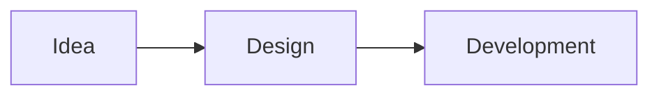

## Tech-first path

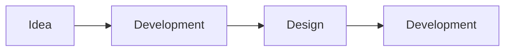

---

# The Challenge

## Key Areas for Improvement

- 🚫 Reducing Rework
- ⚠️ Ensuring Product Quality
- 🧩 Creating Predictable Flow

<!--
- Reducing Rework: Catching misalignments *before* code is written
- Ensuring Product Quality: Preventing critical usability issues from reaching late stages
- Creating Predictable Flow: Giving the development team the clarity they need to build with fewer blockers
-->

---

# Introducing Fastlane UX
Build right, faster, and eliminate rework.
<br>
| What It Is            | What It Is NOT    |
|-----------------------|------------------|
| 👍 Short, async step     | 👎 Bureaucracy      |
| 👍 Source of truth       | 👎 Meetings         |

<!--
A proposal to build right, faster, and eliminate rework by introducing a simple clarity step.

What It Is:
- A short, async, pre-development step to ensure everyone is aligned
- Focuses on creating a single "source of truth" for user flows

What It Is NOT:
- A new layer of bureaucracy
- More meetings
- A design-heavy process
-->

---

# How Fastlane UX Works

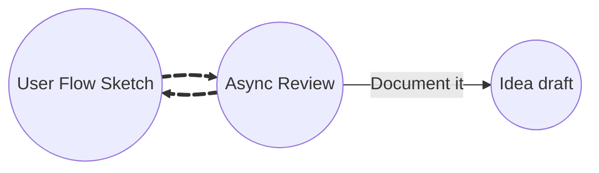
 1. Create **user flow diagram** + **UI wireframes**. 
 2. Iterate with feedback.
 3. Include it in the Idea Draft / Tech Design.

---

# Why This Matters

  - 🚫 Catches UX/flow issues early 
  - 🐛 Prevent critical bugs 
  - 🧭 One clear "source of truth" 
  - 🚀 Shipping Velocity 
  - 🤝 Partner Trust 

<!--
- Reduces questions, blockers, and back-and-forth
-->
---

# User Flow Standard

We all speak the same language.

- 🧐 Clarity & Consistency
- ⚡️ Efficiency
- 🗣️ Communication

<!--
- Single, shared language for diagrams, eliminates ambiguity in communication
- Accelerates creation process
- Ensures accurate reflection of user experience
-->

<style scoped>
  .kroki-image-container {
    background: transparent;
  }
</style>

---


<div class="container">
<div>

# The tools
- 💻 Mermaid
- 🎨 FigJam
- ✏️ Excalidraw
</div>

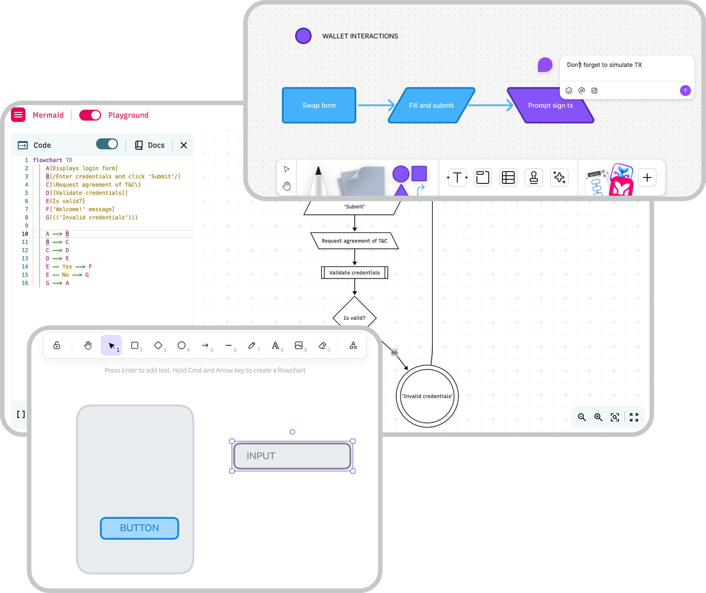
</div>

<style scoped>
  .container {
    width: 100%;
    gap: 5rem;
    display: grid;
    grid-template-columns: repeat(2, 1fr);
  }
  img:not(.emoji) {
    transform: scale(1.25) translate(-20%, 0%);
    background: transparent;
  }
</style>

---

# Mermaid: Our Source of Truth
<div class="container">
<div>

A text-based tool for generating diagrams and charts.

- ✏️ Easy to Edit
- 🔗 Integration-Friendly
- 🤖 Boosted by LLMs
<br>

[🔗 Mermaid docs](https://mermaid.js.org/intro/)
[🔗 Mermaid playground](https://mermaid.live/)
</div>

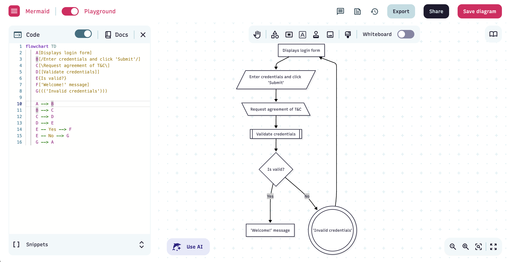
</div>
<!--
- Quickly modify flows by changing text, no need to manually realign shapes
- Can be embedded directly into documentation
-->

<style scoped>
  .container {
    width: 100%;
    gap: 5rem;
    display: grid;
    grid-template-columns: repeat(2, 1fr);
  }
  img:not(.emoji) {
    transform: scale(1.25) translate(-10%, 10%);
  }
</style>

---

# Standard Shapes and Meanings

| Mermaid | Intent Type | Description | Shape |
|-------------|----------------|-------------|-------|
| `[/…/]` | UI Trigger | UI action initiated by user (click, submit, etc.) | Parallelogram |
| `[\…\]` | UI Prompt | Request for user input or confirmation | Parallelogram alt |
| `[…]` | System Output | UI feedback shown to user | Rectangle |
| `[[…]]` | Processing | System logic or computational task | Double rectangle |
| `{…}` | Decision | Condition or branching logic | Diamond |
| `(((…)))` | Error | Error state or user-facing error message | Double circle |

<style scoped>
  table {
    transform: scale(0.8) translateY(-10%);
  }
</style>

---

# Mermaid Shapes

<div class="container">

```
    A[/ UI Trigger /]
    B[\ UI Prompt \]
    C[ System output ]
    D[[ Processing ]]
    E{ Decision }
    F((( Error )))
```

<div class="shapes">

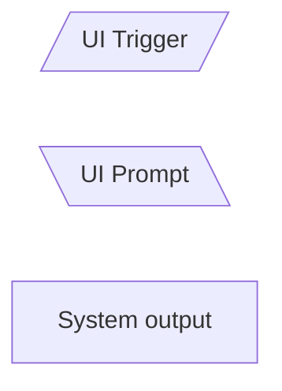
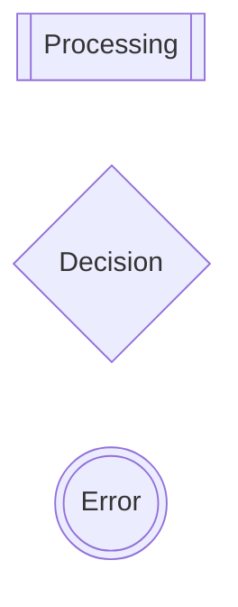
</div>
</div>

<style scoped>
  .container {
    width: 100%;
    gap: 5rem;
    display: grid;
    grid-template-columns: repeat(2, 1fr);
  }

  .shapes{
    display: flex;
    align-items: center;
    gap: 2rem;
    transform: translateY(-20%);
  }

  marp-pre {
    height: fit-content;
  }

  .kroki-image-container {
    background: transparent;
  }
</style>

---

# Example flow

<div class="container">

```
flowchart TD
    A[Displays login form]
    B[/Enter credentials and click 'Submit'/]
    C[\Request agreement of T&C\]
    D[[Validate credentials]]
    E{Is valid?}
    F['Welcome!' message]
    G((('Invalid credentials')))

    A --> B
    B --> C
    C --> D
    D --> E
    E -- Yes --> F
    E -- No --> G
    G --> A
```

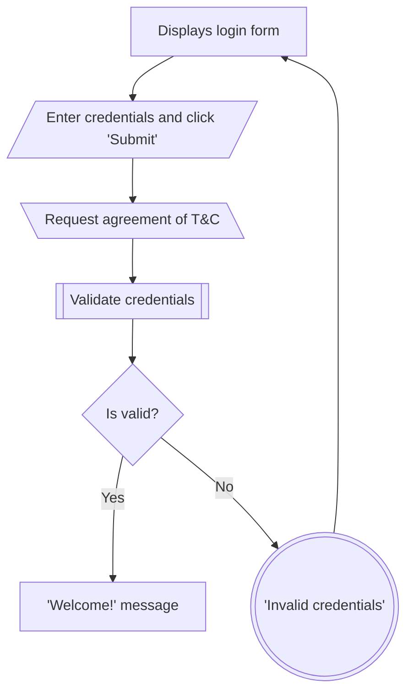
</div>

<style scoped>
  .container {
    width: 100%;
    gap: 5rem;
    display: grid;
    grid-template-columns: repeat(2, 1fr);
  }

  marp-pre {
    height: fit-content;
  }

  .kroki-image-container {
    transform: scale(0.7) translateY(-40%);
  }
</style>

---

# FigJam: Our Collaboration Space
An online collaborative whiteboard.

<div class="container">

- 🎨 Visual and simple tool
- 🤝 Real-time collaboration
- 🧑‍🤝‍🧑 Good for non-tech people

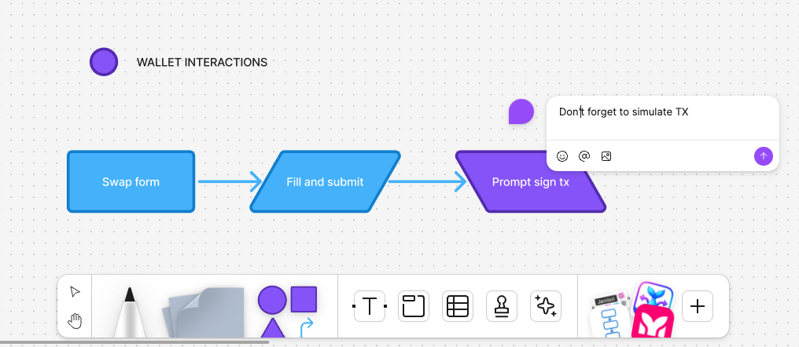

</div>

[🔗 User Flow Standard FigJam Board](https://www.figma.com/board/ZOdKsuqIg9Oo4ISCFtTpSG/User-flow-standard?node-id=0-1&t=ADjb9pLhMhNKEVKE-1)


<style scoped>
  .container {
    width: 100%;
    gap: 5rem;
    display: grid;
    grid-template-columns: repeat(2, 1fr);
  }
</style>

---

# AI-Assisted Workflow

## Sequence Diagram to Flowchart Conversion

We can use AI to translate technical `sequenceDiagram` into user-centric `flowchart`.

### The Process
1. Sequence diagram as input
2. Ask the LLM for helping
3. Polishing, make it simpler

[🔗 Prompt](https://www.notion.so/defi-wonderland/Prompt-sequenceDiagram-to-flowchart-2379a4c092c78048a47ffd575a890131)

<!--
- Especially useful when working from engineering specs
- Focus on user perspective, not backend APIs
-->

---

# User Flow Example: Private Senders flow

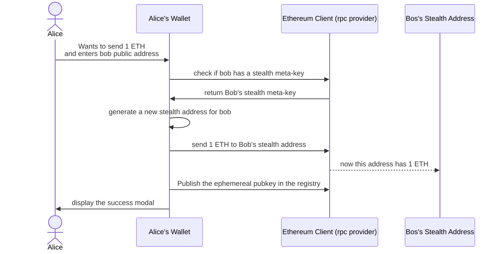
<style scoped>
.kroki-image-container {
    transform: scale(0.75) translateY(-10%);
  }
</style>

---

# User Flow Example: Output (Flowchart)
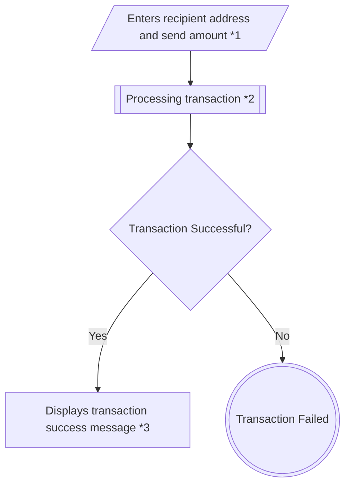

<!--
## Supplementary Notes
- **1. Send Details:** User provides recipient's public address and ETH amount
- **2. Stealth Processing:** Wallet checks stealth meta-key, generates stealth address, sends ETH, publishes ephemeral key
- **3. Privacy Benefit:** Observer cannot link transaction to recipient's main address
-->

<style scoped>
.kroki-image-container {
  transform: scale(0.7) translate(25%, -15%);
}
</style>

---

# Wireframing for Non-designers

## The Three Core Ideas

<div class="container">

- 📝 Functional sketch
- 🔲 Simplest shapes
- 🎯 One goal for each screen

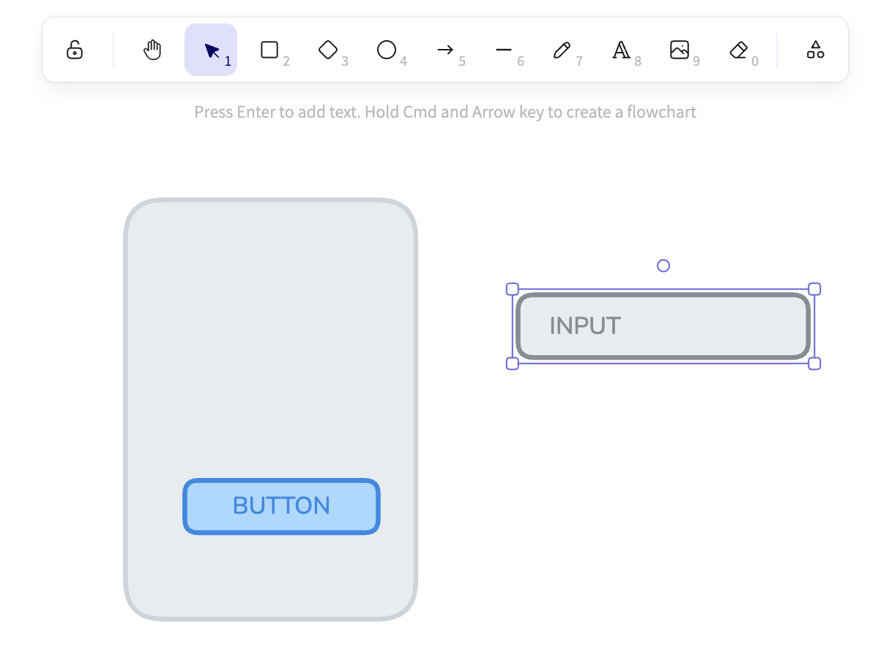

</div>

<style scoped>
  .container {
    width: 100%;
    gap: 5rem;
    display: grid;
    grid-template-columns: repeat(2, 1fr);
  }
  img:not(.emoji) {
    transform: scale(1.25) translate(-10%, -10%);
  }
</style>

<!--
- Functional outline, not visual design
- Focused on structure, not aesthetics
- One primary purpose per screen
-->

---

# Wireframes (1/3): Define the Screen's Purpose
What is the main goal? Display, collect, process?

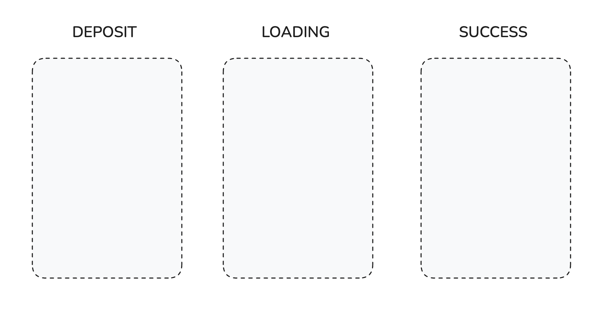

<style scoped>
  img {
    transform: scale(0.7) translate(0, -20%);
  }
</style>

---

# Wireframes (2/3): Draw content Mobile-First

Simple shapes, use shades of gray. Mobile forces to keep it simple.

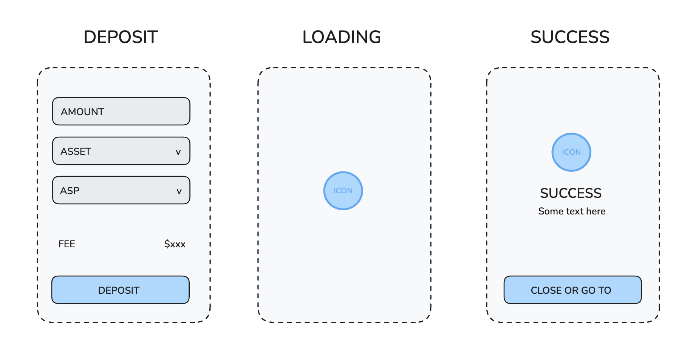

<style scoped>
  img {
    transform: scale(0.7) translate(0, -20%);
  }
</style>

---

# Wireframes (3/3): Connect Your Screens

Simple shapes, use shades of gray. Mobile forces to keep it simple.

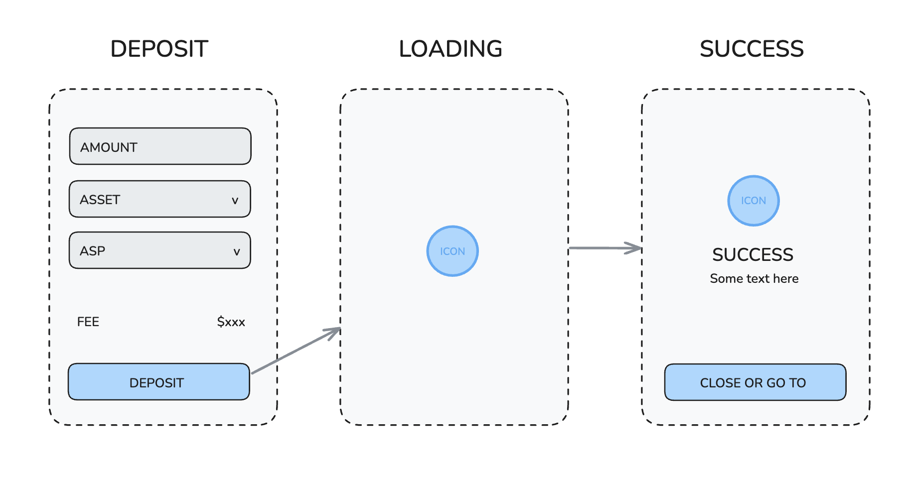

<style scoped>
  img {
    transform: scale(0.7) translate(0, -20%);
  }
</style>

---

# Wireframing Best Practices

<div class="container">

<div>

## 👍 Do This
- Keep it simple
- Annotate Smartly
- Collaborate
</div>
<div>

## 👎 Avoid This
- Design details
- Over-explaining
- Visual perfection
</div>
</div>

<style scoped>
  .container {
    width: 100%;
    gap: 5rem;
    display: grid;
    grid-template-columns: repeat(2, 1fr);
  }
</style>

<!--
Do This:
- Keep it simple: Avoid any visual design
- Annotate Smartly: Only add notes necessary for understanding
- Collaborate: Share sketches early for quick feedback

Avoid This:
- Design details like colors or specific fonts
- Over-explaining obvious elements
- Getting caught up in visual perfection
-->
---

# Excalidraw: Our Wireframing Tool

<div class="container">
<div>

## Why Excalidraw?

- ✏️ Sketch-like Feel
- ⚡ Speed & Simplicity
- 🆓 Free & Accessible
- 🔗 Easy Sharing
- 🚫 No Design Temptations
<br>

[🔗 excalidraw.com](https://excalidraw.com/)
</div>

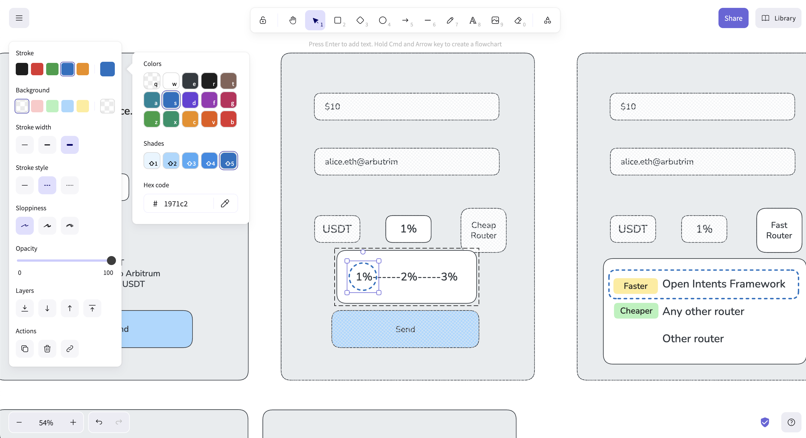
</div>

<style scoped>
  .container {
    width: 100%;
    gap: 5rem;
    display: grid;
    grid-template-columns: repeat(2, 1fr);
  }
  img:not(.emoji) {
    transform: scale(1.4) translate(-10%, 20%);
  }
</style>

<!--
- Sketch-like Feel: Reinforces "low-fidelity" aspect
- Speed & Simplicity: Intuitive interface, quick drawing
- Free & Accessible: Browser-based, no complex setup
- Easy Sharing: Export as images or share live canvas links
- No Design Temptations: Keeps focus on essential layout
- Reinforces "not a design" aspect
- Keeps focus on essential layout and function
-->

---

# Excalidraw Cheatsheet

<div class="container">
<div>

- Select Tool: `V` or `1`
- Rectangle: `R` or `2`
- Circle/Ellipse: `O` or `4`
- Arrow: `A` or `5`
- Line: `L` or `6`
- Text: `T` or `8`

<br>

[🔗 Excalidraw Cheatsheet](https://www.notion.so/defi-wonderland/Excalidraw-Cheatsheet-for-Wireframing-2339a4c092c7800294e9edbd0914188d)

</div>

<div>

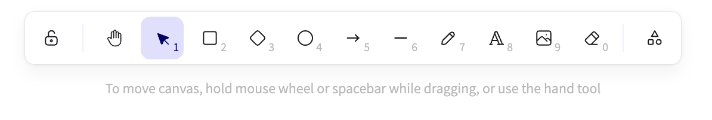
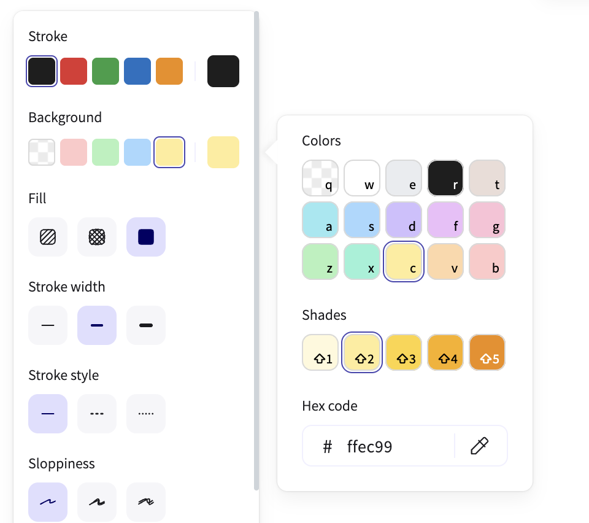
</div>
</div>

<!--
This slide is already concise and practical - keeping all shortcuts visible for reference during wireframing sessions.
-->

<style scoped>
  .container {
    width: 100%;
    gap: 5rem;
    display: grid;
    grid-template-columns: repeat(2, 1fr);
  }
  img:not(.emoji) {
    transform: scale(1) translate(-20%, 0);
  }
</style>

---

# Mermaid to Figma Plugins

<div class="container">
<div>

Not fully compatible yet 😞
but can help a little bit.
<br>

[🔗 Plugins](https://www.notion.so/defi-wonderland/User-flow-standard-2339a4c092c780d785a4cae477aab8d5#2339a4c092c78039a4e9c32e0c25c024)
</div>

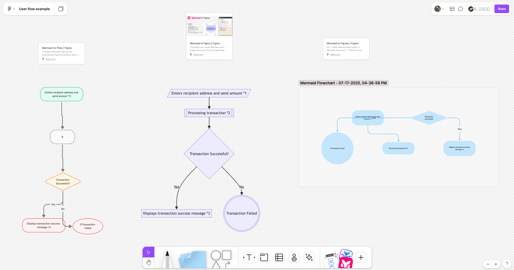
<br>
<br>
<br>
<br>
</div>

<!--
> ⚠️ **Note:** These plugins are experimental and far from perfect, but they can speed up the process.
-->

<style scoped>
  .container {
    width: 100%;
    gap: 5rem;
    display: grid;
    grid-template-columns: repeat(2, 1fr);
  }
  img:not(.emoji) {
    transform: scale(1.5) translate(-20%, 20%);
  }
</style>

---

# Thank You 🦌💜

**Questions? Comments? Concerns?**


---

<!-- _class: lead -->
# Appendix

## 🔗 Additional Resources

- [⚡️ Fastlane UX](https://www.notion.so/defi-wonderland/Fastlane-UX-A-bridge-between-code-and-design-2169a4c092c7803da0d5e258ba13efef)
- [🪨 User flow standard](https://www.notion.so/defi-wonderland/User-flow-standard-2339a4c092c780d785a4cae477aab8d5)
- [😎 Wireframing for Non-designers](https://www.notion.so/defi-wonderland/Wireframing-for-Non-designers-2339a4c092c78029a83cd072ac73d413)
- [🎨 Excalidraw Cheatsheet](https://www.notion.so/defi-wonderland/Excalidraw-Cheatsheet-for-Wireframing-2339a4c092c7800294e9edbd0914188d)
- [📦 User flow AI generated example](https://www.notion.so/defi-wonderland/User-flow-AI-generated-example-2339a4c092c780f195e4cb248f465a7b)